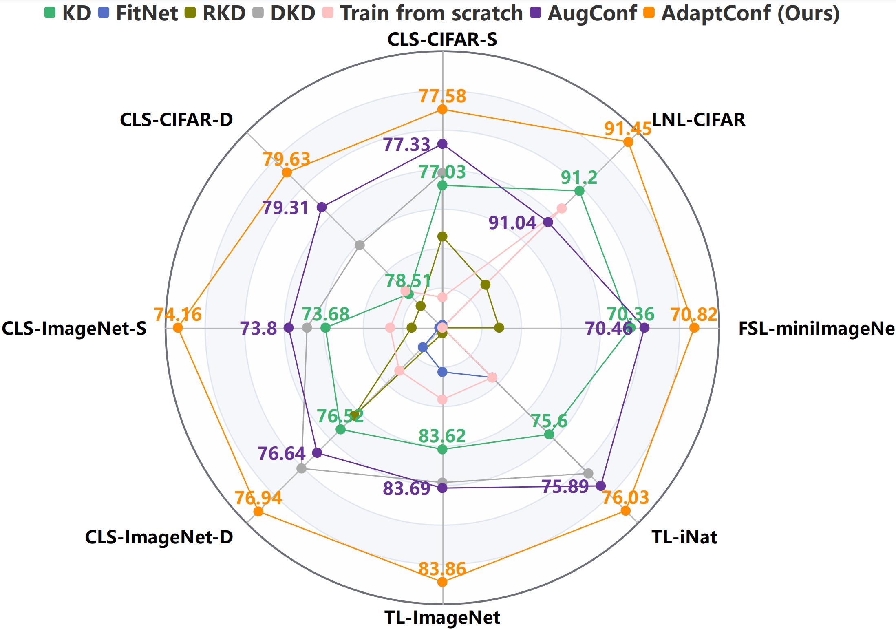

## Implementation of  "[Vision Superalignment: Weak-to-Strong Generalization for Vision Foundation Models]()".


<p align="center">
  
</p>
<p align="center">
</p>
Recent advancements in large language models have sparked interest in their extraordinary and near-superhuman capabilities, leading researchers to explore methods for evaluating and optimizing these abilities, which is called superalignment. In this context, our paper delves into the realm of vision foundation models, focusing on the concept of weak-to-strong generalization, which involves using a weaker model to supervise a stronger one, aiming to enhance the latter's capabilities beyond the former's limits. We introduce a novel and adaptively adjustable loss function for weak-to-strong supervision. Our comprehensive experiments span various scenarios, including few-shot learning, transfer learning, noisy label learning, and common knowledge distillation settings. The results are striking: our approach not only exceeds the performance benchmarks set by strong-to-strong generalization but also surpasses the outcomes of fine-tuning strong models with whole datasets. This compelling evidence underscores the significant potential of weak-to-strong generalization, showcasing its capability to substantially elevate the performance of vision foundation models.


#### Set up
```
- python==3.x
- torch==1.10.2+cu113
- torchvision==0.11.3+cu113
- timm==0.6.12

# Other pytorch/cuda/timm version can also work
```

#### Data preparation

Download  [CIFAR](https://www.cs.toronto.edu/~kriz/cifar.html)/[ImageNet](http://image-net.org/) images from their websites.
For example, the ImageNet directory structure is:

```
│path/to/imagenet/
├──train/
│  ├── n01440764
│  │   ├── n01440764_10026.JPEG
│  │   ├── n01440764_10027.JPEG
│  │   ├── ......
│  ├── ......
├──val/
│  ├── n01440764
│  │   ├── ILSVRC2012_val_00000293.JPEG
│  │   ├── ILSVRC2012_val_00002138.JPEG
│  │   ├── ......
│  ├── ......
```

#### Classification on CIFAR-100

<details>
<summary>
Student: ResNet56, Teacher: ResNet20
</summary>

To train ResNet56 (Teacher: ResNet20) on CIFAR-100 with **AdaptConf** on 8 gpus:

```
python -m torch.distributed.launch --nproc_per_node=8 train.py /cache/data/cifar/ --config configs/cifar_v0.yaml --model resnet56 --distiller adaptconf --output /cache/output/res56_res20_adaptconf --teacher resnet20 --teacher-pretrained /cache/ckpt/cifar/v0_resnet20_68.93.pth --superalignment-rate 0.3 --superalignment-threshold 0.5
```
</details>

<details>
<summary>
Student: VGG13, Teacher: VGG8
</summary>

To train VGG13 (Teacher: VGG8) on CIFAR-100 with **KD** on 8 gpus:

```
python -m torch.distributed.launch --nproc_per_node=8 train.py /cache/data/cifar/ --config configs/cifar_v1.yaml --model vgg13 --distiller kd --output /cache/output/vgg13_vgg8_adaptconf --teacher vgg8 --teacher-pretrained /cache/ckpt/cifar/vgg8_71.99.pth
```

To train VGG13 (Teacher: VGG8) on CIFAR-100 with **AdaptConf** on 8 gpus:

```
python -m torch.distributed.launch --nproc_per_node=8 train.py /cache/data/cifar/ --config configs/cifar_v1.yaml --model vgg13 --distiller adaptconf --output /cache/output/vgg13_vgg8_adaptconf --teacher vgg8 --teacher-pretrained /cache/ckpt/cifar/vgg8_71.99.pth --superalignment-rate 0.3 --superalignment-threshold 0.5
```
</details>

#### Transfer Learning on ImageNet-1K

<details>
<summary>
Student: ViT-B, Teacher: ResNet50
</summary>

To finetune MAE pretrained ViT-B on ImageNet-1K with adaptconf on 8 gpus:

```
python -m torch.distributed.launch --nproc_per_node=8 train.py /cache/data/imagenet/ --config configs/imagenet_mae.yaml --model vit_base_patch16_224 --amp --distiller adaptconf --finetune /cache/ckpt/mae_pretrain_vit_base.pth --output /cache/output/imgaenet/vit_adaptconf/ --teacher resnet50 --teacher-pretrained /cache/ckpt/imagenet/resnet50_a1_0-14fe96d1.pth --superalignment-rate 0.3 --superalignment-threshold 4.0
```
</details>


#### Notice

Our CIFAR training is conducted using 8 GPUs, in contrast to the previous codebase that utilized only 1 GPU. In order to achieve a comparable baseline accuracy between the student and teacher models, we experimented with both the ```configs/cifar_v0.yaml``` and ```configs/cifar_v1.yaml``` configurations.

#### Few shot learning on miniImageNet
You can find the detailed from [`few_shot_leaerning/README.md`.](https://github.com/ggjy/vision_weak_to_strong/blob/main/few_shot_leaerning/README.md)

#### Noisy labels learning on miniImageNet
You can find the detailed from [`noisy_labels_learning/README.md`.](https://github.com/ggjy/vision_weak_to_strong/blob/main/noisy_labels_learning/README.md)

### Results and Models

#### Classification on CIFAR-100

| Teacher | ResNet20 | VGG8 | ShuffleNet-V1 |  ShuffleNet-V1 |
| :---: | :---: | :---: | :---: | :---: |
| **Student** | **ResNet56** | **VGG13** | **ResNet32x4** | **ResNet32x4** |
| KD | 73.81 | 76.41 | 80.19 | 80.31 |
| AugConf | 73.86 | 76.55 | 80.62 | 80.84 |
| AdaptConf | 74.17 | 76.84 | 80.99 | 81.06 |


### Citation

If you find this project useful in your research, please consider cite:

```bibtex
@article{guo2024vision,
  title={Vision Superalignment: Weak-to-Strong Generalization for Vision Foundation Models},
  author={Guo, Jianyuan and Chen, Hanting and Wang, Chengcheng and Han, Kai and Xu, Chang and Wang, Yunhe },
  journal={arXiv preprint arXiv:},
  year={2024}
}
```


### Acknowledgement

The classification task in this repo is based on [OFAKD](https://github.com/Hao840/OFAKD/tree/main), [DKD](https://github.com/megvii-research/mdistiller) and [timm](https://github.com/rwightman/pytorch-image-models).

The transfer learning  in this repo is baesd on [MAE](https://github.com/facebookresearch/mae).

The few shot learning in this repo is baesd on [few-shot-meta-baseline](https://github.com/yinboc/few-shot-meta-baseline).

The noisy labels learning in this repo is baesd on [Sel-CL](https://github.com/ShikunLi/Sel-CL).

### License

[](https://opensource.org/licenses/MIT)
